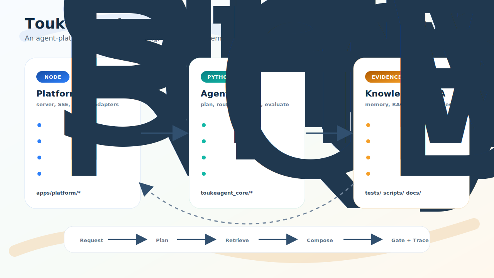

# ToukeAgent

> 一个围绕 `Plan-to-Act`、`micro-ReAct`、Memory、RAG、动态 Wiki、评测 harness 和人工治理构建的 Agent 平台原型。

[English](./README.md) · [架构说明](./docs/toukeagent-main-architecture.md) · [开发手册](./docs/development-playbook.md) · [工程手册](./docs/engineering-manual.md)



## 这个项目为什么存在

ToukeAgent 想回答一个很实际的问题：

> 如果 Agent 不只是一个聊天框，那它背后的平台骨架应该长什么样？

这个仓库不是在假装自己已经是成熟商业产品。它更像一个面向 Agent 实习、HR 初筛和技术面试的工程作品集：把规划、检索、记忆、流式输出、质量门控、轨迹回放和人工接管这些能力，尽量接成一个能被阅读、运行和追问的系统。

有些地方仍然粗糙，这很正常。它不是穿西装的黑盒，而是贴了标签的实验台。

## 它主要展示什么

- `Plan-to-Act + micro-ReAct`：先生成任务计划，再按小步执行和评估。
- `Node shell + Python core`：Node 负责平台接线，Python 负责 Agent 决策。
- 混合知识路由：把稳定 RAG、动态 Wiki 卡片、长期 Memory 拆成不同知识层。
- 评测优先：generation、retrieval、memory、wiki、knowledge 都有 harness 和 review artifact。
- 人工控制面：审批暂停、人工接管、恢复执行、死信队列、trace replay 都进入主流程。
- OpenSpec 驱动：需求、设计、契约、任务和验收标准都放在代码旁边。

## 系统结构

ToukeAgent 主要分成三层：

| 层级 | 职责 | 代表文件 |
| --- | --- | --- |
| Node 平台壳 | HTTP API、SSE、浏览器控制台、存储、投递、provider gateway、工具执行 | `apps/platform/server.mjs`, `apps/platform/src/*.mjs` |
| Python Agent Core | 规划、检索路由、模型路由、草稿生成、质量门控决策 | `toukeagent_core/*.py` |
| 契约与证据层 | 跨层 schema、OpenSpec、测试、benchmark、文档 | `packages/contracts/`, `openspec/`, `tests/`, `docs/` |

一句话版本：Node 让平台跑起来，Python 决定 Agent 下一步做什么，测试和 trace 负责让它们别太飘。

## 快速开始

环境要求：

- Node.js，需支持内置 `node:test`
- Python 3.11+
- 可选：DeepSeek 兼容 API key，用于真实模型调用

```bash
git clone <your-fork-or-repo-url>
cd ToukeAgent

cp config/model-config.example.json config/model-config.local.json
# 如果需要远程模型调用，在 config/model-config.local.json 里填入 key。

python3 -m toukeagent_core --action create_plan --payload '{}'
npm run test:contracts
node --check apps/platform/server.mjs
npm run dev
```

然后打开本地平台：

```text
http://127.0.0.1:3000
```

本地体检命令：

```bash
python3 scripts/runtime_doctor.py
```

如果 doctor 提示服务不可达，先启动 `npm run dev`。它是 doctor，不是魔法师。

## 常用命令

```bash
npm run dev
npm run doctor
npm run test:contracts
npm test
npm run smoke:live
npm run smoke:stream
npm run smoke:stream-reconnect
npm run smoke:approval
npm run smoke:restart
npm run smoke:wiki-first
npm run smoke:delivery
```

`npm run test:contracts`、`node --check apps/platform/server.mjs` 和上面的 Python core 命令更适合快速确认公开入口。更完整的 `npm run test:server` 和 `npm test` 会包含一些偏重的集成测试和评测路径；在这次作品集整理时，`test:server` 仍有两个已知 WIP 断言需要后续回看。面试展示时，更推荐跑几个定向测试加一个 smoke，而不是让面试官围观终端冥想。

## 知识系统与评测

ToukeAgent 把知识拆成三类：

- `RAG`：稳定的长文资料，例如论文、工程笔记和文档。
- `Wiki`：短小的动态状态卡，例如当前项目状态、版本、决策和经常变化的事实。
- `Memory`：长期用户事实、短期会话记忆、压缩快照和 handoff 上下文。

评测也按关注点拆开：

- 检索质量：`scripts/benchmark_retrieval_quality.py`
- 生成质量：`scripts/evaluate_generation_quality.py`
- 记忆质量：`scripts/benchmark_memory_quality.py`
- Wiki 质量：`scripts/evaluate_wiki_quality.py`
- 统一知识链路：`scripts/evaluate_knowledge_quality.py`

这里故意把“过程”做得比 demo 更重一点。Agent 系统最怕悄悄失败；harness 的作用就是让失败更响、更可复盘。

## 仓库地图

| 路径 | 重点内容 |
| --- | --- |
| `apps/platform/` | Node 平台壳、server、SSE、浏览器控制台、stores、adapters |
| `toukeagent_core/` | Python 规划、检索、memory policy、quality gate、编排逻辑 |
| `packages/contracts/` | message、plan、stream、tool、delivery、knowledge 等跨层契约 |
| `tests/` | 单元、集成、harness、policy、runtime、server 测试 |
| `scripts/` | smoke、语料工具、评测脚本、benchmark runner |
| `openspec/` | 需求、设计、契约、任务、验收场景 |
| `docs/` | 架构说明、工程手册、精选 playbook、发布检查清单 |
| `data/wiki/notes/` | 可公开的小型 Wiki 样例卡片，用于 smoke 和评测 |

## 面试时我会重点讲什么

- 我没有把系统做成一个巨大的 prompt loop，而是拆出了 runtime 边界、契约和 store。
- 我把 RAG、Memory、动态 Wiki 分开处理，因为它们的失败方式完全不一样。
- 我比较早就补了 evaluation harness，所以优化不是只靠“感觉更好”。
- 我把人工审批、接管和恢复放进主流程，因为 Agent 系统需要知道什么时候该停手。
- 我用 OpenSpec 记录范围和取舍，让项目在面试和 code review 里更容易被追问和解释。

## 当前限制

- 这是作品集型平台原型，不是可直接商用的托管服务。
- 部分测试比较重，因为它们覆盖 benchmark 和 harness 路径。
- 本地运行数据、模型缓存、私有笔记、简历和真实 API key 不属于计划中的开源范围。
- 前端控制台以可检查、可解释为主，不追求产品级视觉打磨。
- 部分 provider 行为依赖本地配置和可用模型凭据。

## 公开仓库前的安全边界

开源前请确认这些内容保持未跟踪：

```text
.env
.env.*
config/*.local.json
data/runtime/
data/models/
data/qdrant/
data/papers/raw/
LLM wiki/
resume/
```

公开版本应该展示代码、契约、文档、样例卡片和可复现检查。私有笔记可以继续私有，它们已经打过很多工了。

## 推荐阅读顺序

如果你想快速了解项目：

1. 先读这份 README。
2. 看 `docs/toukeagent-main-architecture.md` 理解系统图。
3. 看 `docs/development-playbook.md` 理解模块边界和工作方式。
4. 简略看 `openspec/changes/add-plantoact-hybrid-memory-agent/README.md` 理解设计意图。
5. 跑 `python3 -m toukeagent_core --action create_plan --payload '{}'` 和一个定向 `npm test` 文件。

## 当前状态

ToukeAgent 目前最准确的定位是：

> 一个 Agent 平台工程作品集项目，复杂度足够用于讨论真实系统设计，也保留了足够诚实的未完成边界。

这份诚实是刻意保留的。Agent 本来就不简单，围绕它的平台至少应该先学会讲真话。
